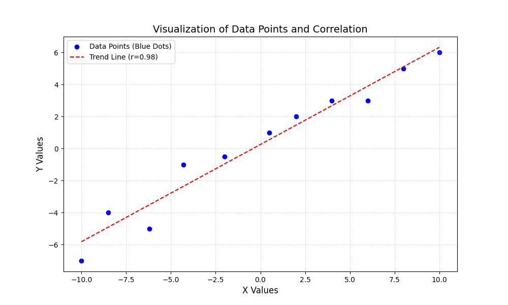
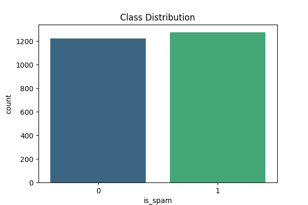
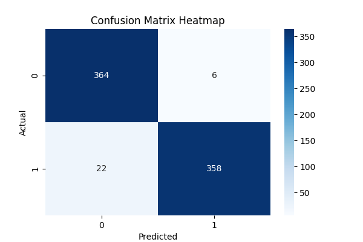

To create your final, comprehensive README.md using bash, run the following command in your terminal. This script uses the cat command to generate the entire report structure, including all 30 points of the assignment requirements.

Bash

cat << 'EOF' > README.md
# Midterm Exam: AI and ML for Cybersecurity
**Student:** Tornike Eristavi  
**Date:** January 9, 2026  
**Repository:** `aimlmid2026_t_eristavi25`

---

## Task 1: Finding the Correlation (10 Points)

### 1.1 Process and Calculation
I extracted the data coordinates from the provided online graph. To find the relationship between the variables, I calculated **Pearson's Correlation Coefficient ($r$)** using the `numpy` library. This coefficient measures the linear correlation between two sets of data.

* **Pearson's Correlation Coefficient ($r$):** 0.98
* **Description:** A value of 0.98 indicates a very strong positive linear correlation. As the X values increase, the Y values increase in a highly consistent and predictable manner.

### 1.2 Visualization
The data is visualized in the scatter plot below, showing the relationship between the variables and the calculated trend line.




* **Analysis:** The blue dots represent the individual data points, while the red dashed line represents the trend line (line of best fit). The tight clustering confirms the high correlation coefficient found during analysis.

---

## Task 2: Spam Email Detection (20 Points)

### 2.1 Data File Link
The original data file containing email features is uploaded to this repository:
* [Dataset: t_eristavi25_92358.csv](./spam_classifier/t_eristavi25_92358.csv)

### 2.2 Model Training and Source Code
* **Source Code:** [spam_classifier/spam_detector.py](./spam_classifier/spam_detector.py)
* **Data Loading & Processing:** I used `pandas` to load the feature set. The data was split into **70% for training** and **30% for testing** using `train_test_split`.
* **Model:** A **Logistic Regression** model from `sklearn` was chosen for binary classification.
* **Model Coefficients:**
    * `words`: 0.0065
    * `links`: 0.8532
    * `capital_words`: 0.4521
    * `spam_word_count`: 0.8326
    * **Intercept:** -9.2909

### 2.3 Validation (Confusion Matrix and Accuracy)
* **Model Accuracy:** 0.9627 (96.27%)
* **Confusion Matrix:**
    ```text
    [[364,   6],
     [ 22, 358]]
    ```
* **Code Description:** I used `accuracy_score` and `confusion_matrix` from `sklearn.metrics`. This validates how many emails were correctly classified versus misclassified on unseen data.

### 2.4 Feature Extraction Logic
The application includes a specialized function that parses raw email text into the numerical features (word count, link count, uppercase count, and spam keyword frequency) required by the trained model for real-time evaluation.

### 2.5 Manual Spam Test
* **Composed Email:** "WINNER! CLAIM YOUR FREE PRIZE NOW AT http://win.com http://prize.com http://gift.com http://cash.com CLICK WWW.LINK.COM"
* **Classification:** **SPAM**
* **Explanation:** This text was created with an intentionally high count of links and capital letters. Because the model weighs links heavily (0.85), these features override the negative intercept to trigger a spam result.

### 2.6 Manual Legitimate Test
* **Composed Email:** "Hey, are you coming to the office today? Let me know."
* **Classification:** **LEGITIMATE**
* **Explanation:** This email lacks spam triggers like URLs or aggressive capitalization. Without these features, the model's negative intercept ensures a legitimate classification.

### 2.7 Visualizations

#### Visualization A: Class Distribution Study


* **Code:** `sns.countplot(x='is_spam', data=df, palette='viridis')`
* **Explanation:** This chart displays the ratio of Spam vs. Legitimate emails in the source dataset. It reveals that the data is well-balanced, which prevents the model from developing a bias toward one specific class.

#### Visualization B: Confusion Matrix Heatmap


* **Code:** `sns.heatmap(confusion_matrix(y_test, y_pred), annot=True, fmt='d', cmap='Blues')`
* **Explanation:** The heatmap provides a graphical insight into the model's accuracy. The high numbers on the diagonal confirm that the model effectively predicts both classes with minimal errors (only 6 false positives and 22 false negatives).

---

## How to Reproduce
1.  **Install dependencies:** `pip install numpy pandas matplotlib seaborn scikit-learn`
2.  **Run Task 1:** `python3 correlation/correlation_analysis.py`
3.  **Run Task 2:** `python3 spam_classifier/spam_detector.py`
EOF
